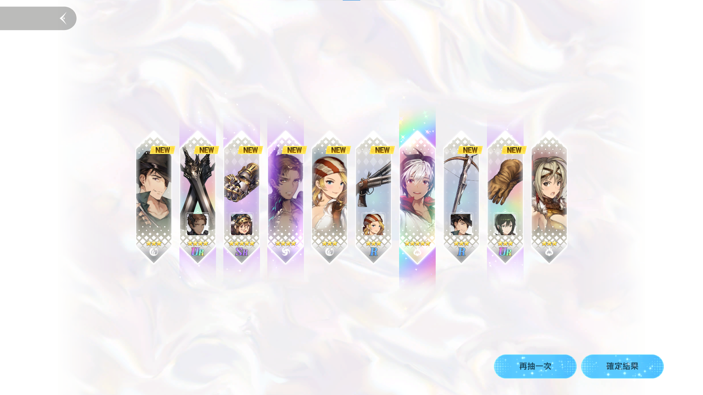

# Auto-Clicker and Template Matching Script

這是一個用於自動點擊並匹配螢幕截圖中模板的腳本。該腳本會不斷捕捉螢幕截圖，尋找指定的按鈕並點擊它們，然後檢查截圖中是否存在指定的模板。

## 使用


- 在此畫面開始運行腳本。
- 鍵盤F9停止腳本。
- 預設目標為同時有克萊與威格UR專武。


## 功能

- 自動點擊指定按鈕（retry、retry confirm、skip）。
- 檢查螢幕截圖中是否存在指定模板。
- 檢查模板中是否存在Ultra rare模板。
- 持續運行直到找到所需模板或按下F9鍵退出。

## 先決條件

### 安裝Python

下載並安裝Python，請訪問[Python官方網站](https://www.python.org)並根據您的操作系統下載合適的版本。安裝時請勾選“Add Python to PATH”選項。

在運行此腳本之前，請確保您的系統中安裝了以下Python庫：

- `opencv-python`
- `numpy`
- `pyautogui`
- `keyboard`
- `pillow`

您可以使用以下命令來安裝這些庫：

```
pip install opencv-python numpy pyautogui keyboard pillow
```
## 運行腳本
在包含上述文件的目錄中打開命令提示符或終端。輸入以下命令來運行腳本：
```
python template_matching.py
```

## 腳本邏輯
如果您想修改想要刷取的卡，請確保新圖片與原圖片具有相同的名稱並放置在相同的目錄中：

- `template1.png：專武或角色 1 圖片` 
- `template2.png：專武或角色 2 圖片`
- `ultra_rare.png：Ultra rare 辨別專武UR`

注意截圖方式，盡量符合原先格式。
